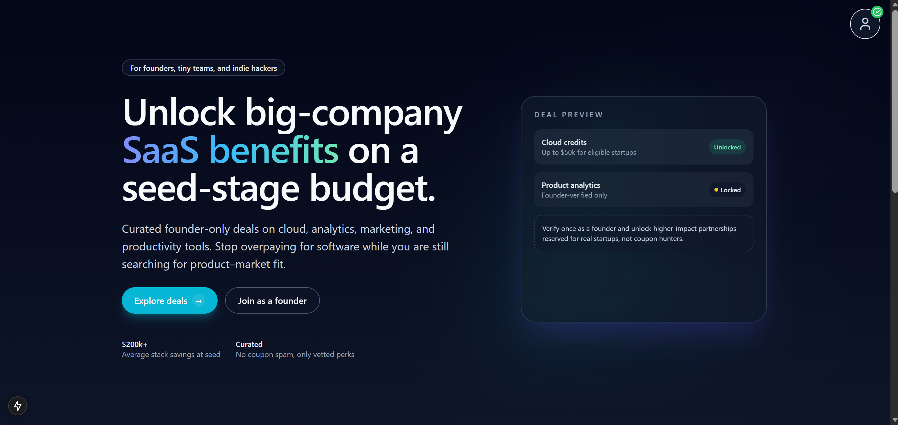
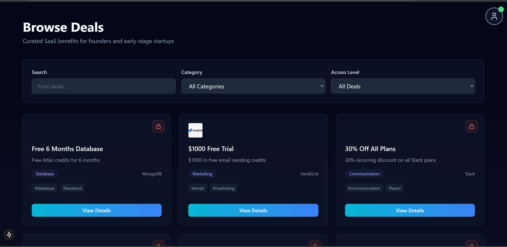
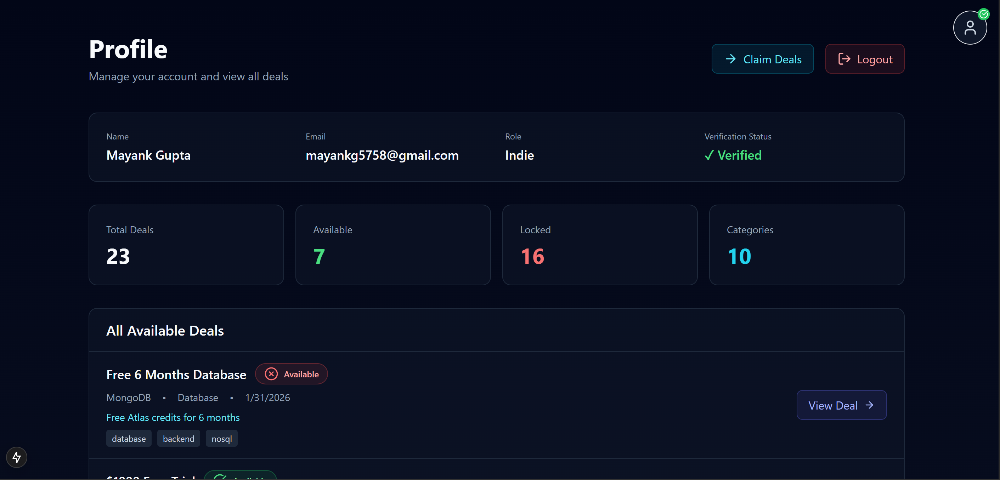

<!-- ===== Custom Dark Theme Styling ===== -->

<style>
body {
  background-color: #000000;
  color: #ffffff;
}
h1, h2, h3, h4 {
  color: #00ff00;
}
h5, h6 {
  color: #ffff00;
}
p, li {
  color: #ffffff;
}
code {
  color: #ff00ff;
  background-color: #333333;
  padding: 2px 4px;
  border-radius: 4px;
}
pre {
  background-color: #333333;
  color: #00ffff;
  padding: 10px;
  border-radius: 8px;
}
a {
  color: #00aaff;
}
blockquote {
  color: #ffa500;
  border-left: 4px solid #ffa500;
  padding-left: 10px;
}
</style>

<!-- ===== Hero Images ===== -->

<div align="center">
 
 <br/><br/>
   
  <br/><br/>
  
</div>


# 🚀 Startup Benefits Platform

<div align="center">
  
  
  
  
  
  
</div>

<div align="center">
  <h3>🌟 Empowering Startups with Exclusive Benefits & Deals</h3>
  <p>A comprehensive platform connecting startups with premium tools, services, and discounts from top-tier partners.</p>
</div>

---

## 📋 Table of Contents

- [✨ Features](#-features)
- [🛠️ Tech Stack](#️-tech-stack)
- [📁 Project Structure](#-project-structure)
- [🔧 Prerequisites](#-prerequisites)
- [🚀 Installation & Setup](#-installation--setup)
- [📖 Usage](#-usage)
- [🔗 API Endpoints](#-api-endpoints)
- [🤝 Contributing](#-contributing)
- [📄 License](#-license)

---

## ✨ Features

### 🎯 Core Functionality
- **🔐 User Authentication**: Secure registration, login, and JWT-based authentication
- **👥 Role-Based Access**: Support for Founders, Team members, and Indie developers
- **🎁 Exclusive Deals**: Curated discounts from premium SaaS partners
- **🔒 Deal Locking**: Eligibility-based access to premium benefits
- **📊 Admin Dashboard**: Comprehensive admin panel for deal management
- **📱 Responsive Design**: Beautiful, mobile-first UI with smooth animations

### 🏢 Startup Benefits
- **💰 Cost Savings**: Up to 90% off on premium tools and services
- **🚀 Growth Acceleration**: Access to tools that scale with your startup
- **🤝 Partner Network**: Connections with industry-leading companies
- **📈 Analytics**: Track benefit utilization and ROI

### 🎨 User Experience
- **🌈 Modern UI**: Gradient backgrounds, animated components, and sleek design
- **⚡ Fast Performance**: Optimized Next.js with server-side rendering
- **🎭 Smooth Animations**: Framer Motion-powered transitions
- **📱 Mobile Optimized**: Responsive across all devices

---

## 🛠️ Tech Stack

### Frontend
- **⚛️ Next.js 15**: React framework with App Router
- **🔷 TypeScript**: Type-safe development
- **🎨 Tailwind CSS**: Utility-first CSS framework
- **🎭 Framer Motion**: Animation library
- **📡 Axios**: HTTP client for API calls
- **🎯 Lucide React**: Beautiful icons

### Backend
- **🚀 Express.js**: Fast, unopinionated web framework
- **🍃 MongoDB**: NoSQL database with Mongoose ODM
- **🔐 JWT**: JSON Web Token authentication
- **🔒 bcryptjs**: Password hashing
- **🌐 CORS**: Cross-origin resource sharing

### Development Tools
- **📦 npm**: Package management
- **🐛 ESLint**: Code linting
- **🎯 Prettier**: Code formatting
- **📋 TypeScript**: Type checking

---

## 📁 Project Structure

```
startup-benefits-platform/
├── 📁 frontend/                    # Next.js Frontend Application
│   ├── 📁 app/                     # Next.js App Router
│   │   ├── 📄 globals.css          # Global styles
│   │   ├── 📄 layout.tsx           # Root layout component
│   │   ├── 📄 page.tsx             # Landing page
│   │   ├── 📁 admin/               # Admin dashboard pages
│   │   ├── 📁 dashboard/           # User dashboard
│   │   ├── 📁 deals/               # Deal listing and detail pages
│   │   ├── 📁 login/               # Authentication pages
│   │   ├── 📁 profile/             # User profile pages
│   │   └── 📁 register/            # Registration pages
│   ├── 📁 components/              # Reusable React components
│   │   ├── 📄 AnimatedClouds.tsx   # Background animation
│   │   ├── 📄 CloudBackground.tsx  # Cloud background component
│   │   ├── 📄 Hero.tsx             # Hero section
│   │   ├── 📄 HowItWorks.tsx       # How it works section
│   │   ├── 📄 MotionButton.tsx     # Animated button
│   │   ├── 📄 SparkleButton.tsx    # Sparkle effect button
│   │   ├── 📄 UserIcon.tsx         # User icon component
│   │   └── 📄 ValueProps.tsx       # Value proposition section
│   ├── 📁 lib/                     # Utility libraries
│   │   ├── 📄 api.ts               # API client functions
│   │   └── 📄 useAuth.ts           # Authentication hook
│   ├── 📄 package.json             # Frontend dependencies
│   ├── 📄 next.config.mjs          # Next.js configuration
│   ├── 📄 tailwind.config.ts       # Tailwind CSS config
│   ├── 📄 tsconfig.json            # TypeScript configuration
│   └── 📄 postcss.config.mjs       # PostCSS configuration
├── 📁 server/                      # Express.js Backend Application
│   ├── 📁 src/                     # Source code
│   │   ├── 📄 index.js             # Main server file
│   │   ├── 📁 middleware/          # Express middleware
│   │   │   └── 📄 auth.js          # Authentication middleware
│   │   ├── 📁 models/              # MongoDB models
│   │   │   ├── 📄 User.js          # User model
│   │   │   ├── 📄 Deal.js          # Deal model
│   │   │   └── 📄 Claim.js         # Claim model
│   │   └── 📁 routes/              # API routes
│   │       ├── 📄 auth.js          # Authentication routes
│   │       ├── 📄 deals.js         # Deal management routes
│   │       └── 📄 claims.js        # Claim management routes
│   ├── 📄 package.json             # Backend dependencies
│   ├── 📄 seed-admin.js            # Admin user seeder
│   ├── 📄 seed-deals.js            # Sample deals seeder
│   ├── 📄 test-auth.js             # Auth testing script
│   ├── 📄 test-claims.js           # Claims testing script
│   └── 📄 test-deals.js            # Deals testing script
├── 📄 .gitignore                   # Git ignore rules
└── 📄 README.md                    # Project documentation (this file)
```

---

## 🔧 Prerequisites

Before running this project, make sure you have the following installed:

- **🐍 Node.js** (v18 or higher) - [Download here](https://nodejs.org/)
- **🍃 MongoDB** (v5 or higher) - [Download here](https://www.mongodb.com/try/download/community)
- **📦 npm** or **🧶 yarn** package manager
- **🔑 Git** for version control

### Environment Variables

Create a `.env` file in the `server/` directory with the following variables:

```env
MONGODB_URI=mongodb://localhost:27017/startup-benefits
JWT_SECRET=your-super-secret-jwt-key-here
PORT=4000
```

---

## 🚀 Installation & Setup

### 1. Clone the Repository

```bash
git clone https://github.com/your-username/startup-benefits-platform.git
cd startup-benefits-platform
```

### 2. Backend Setup

```bash
# Navigate to server directory
cd server

# Install dependencies
npm install

# Start MongoDB (if running locally)
mongod

# Seed admin user
node seed-admin.js

# Seed sample deals
node seed-deals.js

# Start the backend server
npm start
```

The backend will be running at `http://localhost:4000`

### 3. Frontend Setup

```bash
# Open a new terminal and navigate to frontend directory
cd frontend

# Install dependencies
npm install

# Start the development server
npm run dev
```

The frontend will be running at `http://localhost:3000`

### 4. Access the Application

- **🌐 Frontend**: [http://localhost:3000](http://localhost:3000)
- **🔧 Backend API**: [http://localhost:4000](http://localhost:4000)

---

## 📖 Usage

### For Users

1. **📝 Register**: Create an account as a Founder, Team member, or Indie developer
2. **🔓 Login**: Sign in to access your personalized dashboard
3. **🎁 Browse Deals**: Explore available benefits and discounts
4. **📋 Claim Benefits**: Apply for eligible deals based on your startup stage
5. **👤 Profile**: Manage your account and view claimed benefits

### For Admins

1. **🔐 Admin Login**: Use the seeded admin credentials
2. **📊 Dashboard**: Access comprehensive admin panel
3. **➕ Add Deals**: Create new benefit offerings
4. **👀 View Claims**: Monitor benefit utilization
5. **📈 Analytics**: Track platform performance

### Sample Deals Available

The platform comes pre-seeded with exclusive deals from:

- **🎨 Design Tools**: Figma, Canva, Tailwind UI
- **💻 Development**: GitHub Copilot, Sentry, Auth0
- **☁️ Infrastructure**: AWS, DigitalOcean, Google Cloud
- **📧 Communication**: Slack, Zoom, Loom
- **📊 Analytics**: Mixpanel, Datadog, Optimizely
- **💰 Payments**: Stripe credits
- **🔒 Security**: Snyk, MongoDB Atlas

---

## 🔗 API Endpoints

### Authentication
```
POST /api/auth/register     # User registration
POST /api/auth/login        # User login
GET  /api/auth/profile      # Get user profile
POST /api/auth/verify       # Verify user account
```

### Deals
```
GET  /api/deals             # List all deals (with filters)
GET  /api/deals/:id         # Get specific deal
```

### Claims
```
GET  /api/claims            # List user claims
POST /api/claims            # Create new claim
GET  /api/claims/:id        # Get specific claim
PUT  /api/claims/:id        # Update claim status
```
---

## 🤝 Contributing

We welcome contributions! Please follow these steps:

1. **🍴 Fork** the repository
2. **🌿 Create** a feature branch (`git checkout -b feature/amazing-feature`)
3. **💾 Commit** your changes (`git commit -m 'Add amazing feature'`)
4. **📤 Push** to the branch (`git push origin feature/amazing-feature`)
5. **🔄 Open** a Pull Request

### Development Guidelines

- Follow the existing code style and structure
- Write clear, concise commit messages
- Add tests for new features
- Update documentation as needed
- Ensure all tests pass before submitting PR

---

<div align="center">
  <p color="black">Built with ❤️ for the startup community</p>
  <p>
    <a href="#startup-benefits-platform">Back to top ↑</a>
  </p>
</div>

## 🙏 Acknowledgments

- Thanks to all our partner companies for providing exclusive deals
- Special thanks to the startup community for the inspiration
- Built with modern web technologies and best practices

---

<div align="center">
  
  
  
</div>
